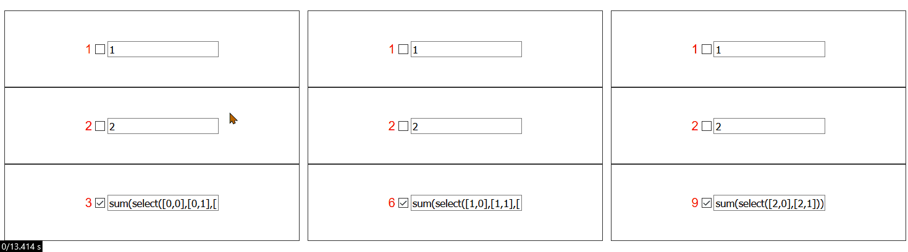

# 响应式表格 demo

使用 vite vue3 实现的一个像 excel 那样可以使用公式，改变了单元格的值 具有公式的单元格 的值会跟着一起变

[在线预览地址](https://2234839.github.io/reactive-table-demo/) [codesandbox 在线尝试地址](https://codesandbox.io/s/github/2234839/reactive-table-demo?utm_medium=plugin&file=/index.html)

